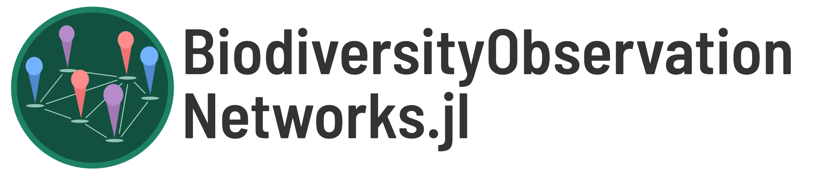

`BiodiversityObservationNetworks.jl` is a Julia toolkit for designing
of biodiversity monitoring and biosurveillance programs. 

The purpose of this package is to provide an extensible and modular
interface for the selection of sampling points for biodiversity processes in
space. This includes methods that target several distinct goals: balanced
sampling, spatial spread, prioritization based on coverage gaps, [active
learning](https://en.wikipedia.org/wiki/Active_learning_(machine_learning)) for model improvevment, and more.

The documentation for the package can be found
[here](https://poisotlab.github.io/BiodiversityObservationNetworks.jl/dev). 
