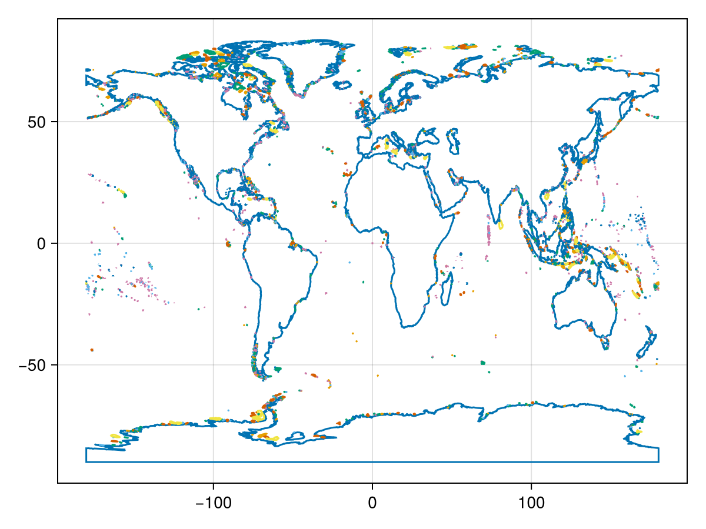

# Getting Started with BiodiversityObservationNetworks.jl {#Getting-Started-with-BiodiversityObservationNetworks.jl}

In this tutorial, we will cover the basics of how to use BiodiversityObservationNetworks.jl. We&#39;ll start by loading the package.

```julia
julia> using BiodiversityObservationNetworks


```


## _Hello World_ in BiodiversityObservationNetworks.jl {#Hello-World-in-BiodiversityObservationNetworks.jl}

The primary use of BiodiversityObservationNetworks is for generating [`BiodiversityObservationNetwork`](/reference/api#BiodiversityObservationNetworks.BiodiversityObservationNetwork) using a variety of point-selection algorithms. Generating networks, regardless of the specific algorithm chosen, is done using the [`sample`](/reference/api#BiodiversityObservationNetworks.sample-Tuple{}) method. The simplest point-selection algorithm is [`SimpleRandom`](/reference/api#BiodiversityObservationNetworks.SimpleRandom), where each location in space (what is meant be location? More on this in the next section) has an equal probability of inclusion.

```julia
bon = sample(SimpleRandom())
```


```ansi
BiodiversityObservationNetwork with 50 nodes
```


By default, [`SimpleRandom`](/reference/api#BiodiversityObservationNetworks.SimpleRandom) (and every other sampler), chooses 50 points. Without any other arguments, [`sample`](/reference/api#BiodiversityObservationNetworks.sample-Tuple{}) chooses points from a raster than covers the entire globe, with each pixel representing a 1˚ by 1˚ region.

When a version of the [Makie](https://docs.makie.org/v0.22/) package for data visualization is loaded, we can use built-in functions to visualize the network. We&#39;ll use the `CairoMakie` backend. (Learn mroe about Makie backends [here](https://docs.makie.org/stable/explanations/backends/backends#What-is-a-backend))

```julia
using CairoMakie
```


We can adjust the number of points to generate by passing an integer directly to [`SimpleRandom`](/reference/api#BiodiversityObservationNetworks.SimpleRandom), i.e.

```julia
srs = SimpleRandom(150)
```


```ansi
SimpleRandom(150)
```


Alternatively, we can use the the `num_nodes` keyword argument

```julia
srs = SimpleRandom(num_nodes=150)
```


```ansi
SimpleRandom(150)
```


Both of these methods for adjusting the number of nodes is supported for all sampling algorithms.

Let&#39;s sample and visualize a [`BiodiversityObservationNetwork`](/reference/api#BiodiversityObservationNetworks.BiodiversityObservationNetwork) with more points

One thing you may notice about the [`BiodiversityObservationNetwork`](/reference/api#BiodiversityObservationNetworks.BiodiversityObservationNetwork) generated using [`SimpleRandom`](/reference/api#BiodiversityObservationNetworks.SimpleRandom) is that many of the points are clumped together. Many of the sampling algorithms in BiodiversityObservationNetworks aim to produce points that are _spatially balanced_, meaning they are well spread out across space, with little clumping. 

One such sampler is [`BalancedAcceptance`](/reference/api#BiodiversityObservationNetworks.BalancedAcceptance). Let&#39;s similarly make a [`BiodiversityObservationNetwork`](/reference/api#BiodiversityObservationNetworks.BiodiversityObservationNetwork) with 300 nodes that are spatially balanced.

```julia
bon = sample(BalancedAcceptance(150))
```


```ansi
BiodiversityObservationNetwork with 150 nodes
```


Much better! However, we are still missing some crucial things here. For example, what if we only want to select sites on land? This brings us to applying sampling algorithms to different _geometries_.

## Geometries in BiodiversityObservationNetworks.jl {#Geometries-in-BiodiversityObservationNetworks.jl}

For most practical use-cases, we aren&#39;t interested in developing a [`BiodiversityObservationNetwork`](/reference/api#BiodiversityObservationNetworks.BiodiversityObservationNetwork) for all of Earth, but instead for a small region delineated by a polygon, or represented using raster data, which may contain useful covariate information that we want to incorporate into our BON design.  

In this case, we want our sampling algorithm `algo` to work on some `geometry` which specifies the spatial domain from which sites should be selected. In this case, we still use `sample`, and pass the spatial domain `geometry` as the second argument, i.e.

```julia
sample(algo, geometry)
```


### A Polygon as a Geometry {#A-Polygon-as-a-Geometry}

For example, maybe we only want to draw points on land. consider drawing a spatially balanced sample using [`BalancedAcceptance`](/reference/api#BiodiversityObservationNetworks.BalancedAcceptance) for the nation of Colombia. We can start by downloading a Polygon representing the land

```julia
julia> using SimpleSDMPolygons


```


Then, we can download a polygon from the NaturalEarth database that represents the land on Earth .

```julia
land = getpolygon(PolygonData(NaturalEarth, Land))
```


```ansi
FeatureCollection with 11 features, each with 0 properties
```


and we can plot it to confirm it&#39;s what we expect

```julia
f = Figure()
ga = Axis(f[1,1])
lines!(ga, land)
f
```

{width=600px height=450px}

Now we can generate a [`BiodiversityObservationNetwork`](/reference/api#BiodiversityObservationNetworks.BiodiversityObservationNetwork) using [`BalancedAcceptance`](/reference/api#BiodiversityObservationNetworks.BalancedAcceptance) in the same way as before, but while passing `col` as a second argument to [`sample`](/reference/api#BiodiversityObservationNetworks.sample-Tuple{})

```julia
bon = sample(BalancedAcceptance(), land)
```


```ansi
BiodiversityObservationNetwork with 50 nodes
```


Wahoo 🥳. We&#39;ve done it. 

### A Raster as a Geometry {#A-Raster-as-a-Geometry}

Okay, but what if you&#39;ve got raster data that describes useful environmental covariates? Or a mask of where we can sample? We can use that too.

Let&#39;s start by downloading a raster to use as a source. 

### Can we feed a BON to itself? {#Can-we-feed-a-BON-to-itself?}

Ethically I&#39;m not 100% sure. But it is technically possible. That&#39;s both true about sampling BONs from BONs, and the moral of Jurassic Park (1994). 

Let&#39;s download Switzerland.

```julia
swi = getpolygon(PolygonData(OpenStreetMap, Places), place="Switzerland")
```


```ansi
FeatureCollection with 1 features, each with 0 properties
```


and now lets choose a buncha random places in there

```julia
candidate_bon = sample(SimpleRandom(500), swi)
```


```ansi
BiodiversityObservationNetwork with 500 nodes
```


Wow. We&#39;re doing groundbreaking work here.

Next up, let&#39;s choose a set of spatially balanced coordinates from this set of candidates. We&#39;ll do this using a different sampling algorithm, called the Pivotal method ([Grafström _et al._, 2012](/bibliography#Grafstrom2012SpaBal)), [`Pivotal`](/reference/api#BiodiversityObservationNetworks.Pivotal). Is this because [`BalancedAcceptance`](/reference/api#BiodiversityObservationNetworks.BalancedAcceptance) doesn&#39;t work on point-like geometries? Yes

```julia
num_points_to_pick = 30
sample(Pivotal(num_points_to_pick), candidate_bon)
```


```ansi
BiodiversityObservationNetwork with 29 nodes
```

