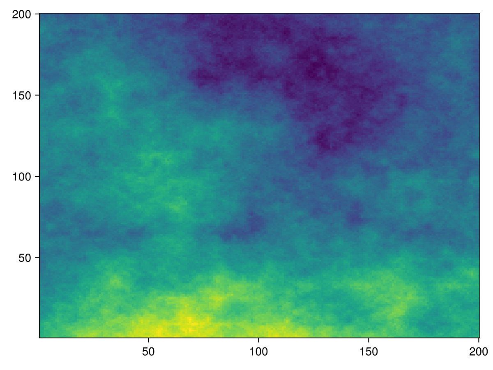

# Getting the entropy matrix {#Getting-the-entropy-matrix}

For some applications, we want to place points to capture the maximum amount of information, which is to say that we want to sample a balance of _entropy_ values, as opposed to _absolute_ values. In this vignette, we will walk through an example using the `entropize` function to convert raw data to entropy values. 

```julia
using BiodiversityObservationNetworks
using NeutralLandscapes
using CairoMakie
```


::: warning Entropy is problem-specific

The solution presented in this vignette is a least-assumption solution based on the empirical values given in a matrix of measurements. In a lot of situations, this is not the entropy that you want. For example, if your pixels are storing probabilities of Bernoulli events, you can directly use the entropy of the events in the entropy matrix.

:::

We start by generating a random matrix of measurements:

```julia
measurements = rand(MidpointDisplacement(), (200, 200)) .* 100
heatmap(measurements)
```



Using the `entropize` function will convert these values into entropy at the pixel scale: 

```@example 1
U = entropize(measurements)
locations =
    seed(BalancedAcceptance(; numsites = 100, uncertainty=U))
```

