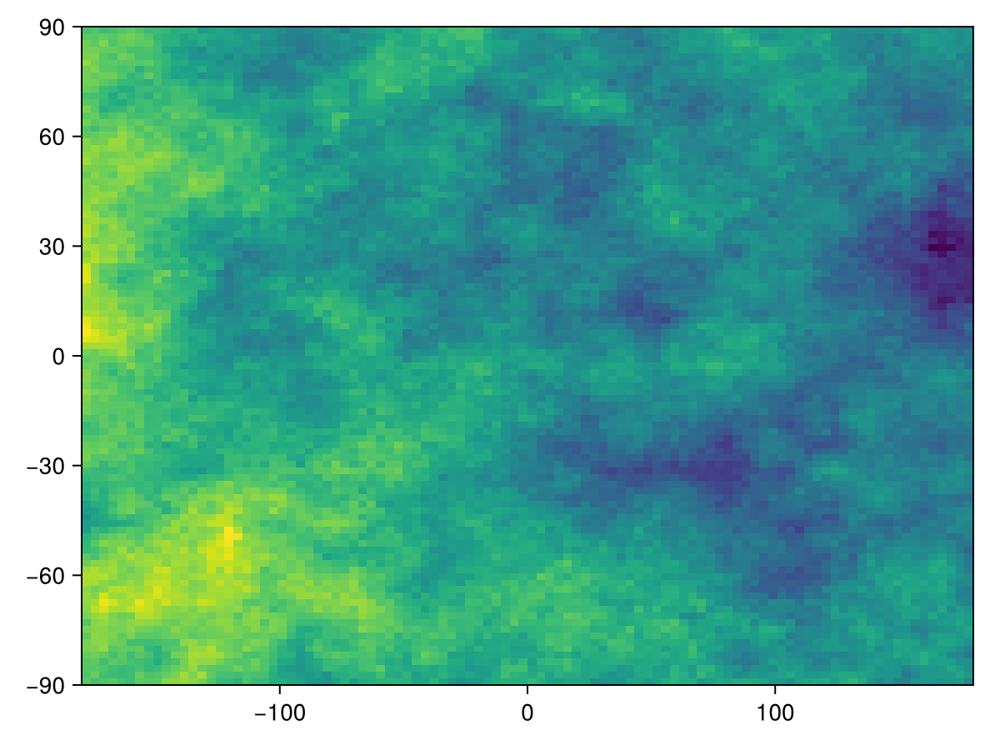

# Adaptive Hotspot {#Adaptive-Hotspot}
<details class='jldocstring custom-block' open>
<summary><a id='BiodiversityObservationNetworks.AdaptiveHotspot-reference-samplers-adaptivehotspot' href='#BiodiversityObservationNetworks.AdaptiveHotspot-reference-samplers-adaptivehotspot'><span class="jlbinding">BiodiversityObservationNetworks.AdaptiveHotspot</span></a> <Badge type="info" class="jlObjectType jlType" text="Type" /></summary>


```julia
AdaptiveHotspot
```


Adaptive hotspot sampling prioritizes high-uncertainty regions while encouraging spatial diversity via a kernel-based criterion. This implementation follows ([Andrade-Pacheco _et al._, 2020](/bibliography#Andrade-Pacheco2020FinHot)): start at the maximum of the uncertainty surface and iteratively add locations that optimize a trade-off between local value and diversity with respect to already chosen sites using a Matérn covariance kernel.

Arguments:
- `num_nodes`: number of sites to select
  
- `scale` (`ρ`): range parameter of the Matérn kernel
  
- `smoothness` (`ν`): smoothness parameter of the Matérn kernel
  


<Badge type="info" class="source-link" text="source"><a href="https://github.com/PoisotLab/BiodiversityObservationNetworks.jl/blob/dd283e4ba53def0fcf6dde9cd8522075462b9a38/src/samplers/adaptivehotspot.jl#L1-L15" target="_blank" rel="noreferrer">source</a></Badge>

</details>


## Example {#Example}

### Using a raster {#Using-a-raster}

First, load the packages we will use for this example

```julia
using BiodiversityObservationNetworks
using CairoMakie
using NeutralLandscapes
import SpeciesDistributionToolkit as SDT
```


Now we&#39;ll generate a synthetic uncertainty layer using [`NeutralLandscapes.jl`](http://docs.ecojulia.org/NeutralLandscapes.jl/dev/).

```julia
uncertainty = SDT.SDMLayer(MidpointDisplacement(), (100, 100))
```


```ansi
🗺️  A 100 × 100 layer with 10000 Float64 cells
   Projection: +proj=longlat +datum=WGS84 +no_defs
```


Let&#39;s plot it

```julia
heatmap(uncertainty)
```

{width=600px height=450px}

and now we sample a BON

```julia
bon = sample(AdaptiveHotspot(), uncertainty)
```


```ansi
BiodiversityObservationNetwork with 50 nodes
```

